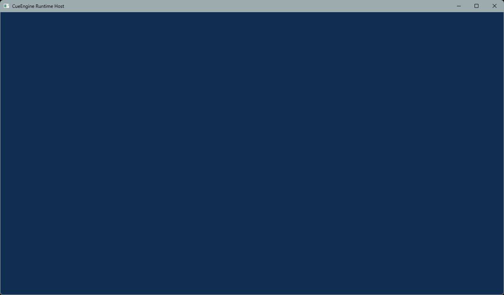

# M05 Render Target Clear Completion Evidence

M05は、Windowに対応するD3D12 Back Bufferを固定色でClearし、Submit、Present、安全な停止までを
RuntimeHostから一貫して実行できる最小描画経路を確立する。

検証日は2026-08-23、Clean Worktreeの対象Commitは`cf30356aacaf49f4e20b267190eabeb7335d8905`である。
Triangle、Shader／Pipeline、Depth Buffer、FrameGraph、Asset／ECS／Editor、Package Distributionは対象外とする。

## Scope Delivered

| Issue | Pull Request | Result |
| --- | --- | --- |
| [#52 Back Buffer Resource State Transition](https://github.com/tochouseito/CueEngine/issues/52) | [#83](https://github.com/tochouseito/CueEngine/pull/83) | Current Back Bufferの`PRESENT -> RENDER_TARGET -> PRESENT`遷移を実装 |
| [#53 Render Target Clear Command](https://github.com/tochouseito/CueEngine/issues/53) | [#84](https://github.com/tochouseito/CueEngine/pull/84) | Current RTVの固定色Clearと`ClearBackBuffer` Markerを実装 |
| [#54 Clear・Submit・Present Frame Loop](https://github.com/tochouseito/CueEngine/issues/54) | [#85](https://github.com/tochouseito/CueEngine/pull/85) | 300 FrameのClear、Execute、Fence Signal、Present、Shutdownを統合 |
| [#55 Resize・Minimize・Shutdown同期](https://github.com/tochouseito/CueEngine/issues/55) | [#86](https://github.com/tochouseito/CueEngine/pull/86) | Event集約、50回Lifecycle Smoke、Close優先、逆順Shutdownを統合 |
| [#56 Completion Gate](https://github.com/tochouseito/CueEngine/issues/56) | 本変更 | Clean Checkout、実表示、診断、依存方向、Release内容を統合検証 |

## Frame契約

`PresentationContext::present_frame()`は、Platform非依存のClear Colorを受け取り、次の順序を一つの
生成Thread限定操作として実行する。

1. Current Back Buffer Indexに対応するFrame Contextの再利用Fence完了を確認する。
2. AllocatorとCommand ListをResetする。
3. Back Bufferを`PRESENT`から`RENDER_TARGET`へ遷移する。
4. 固定色でClearし、`PRESENT`へ戻してCommand ListをClose、Executeする。
5. `IDXGISwapChain3::Present`を試行する。
6. Execute済みWorkを覆うFenceをSignalしてFrame Contextへ保存する。
7. Present成功後のCurrent Back Buffer Indexを取得する。

公開RHI APIはNative Fence値、DXGI型、D3D12型を公開しない。Fence値とFrame Contextの対応はD3D12
TestSupportで診断し、公開APIは`Presented`または`Occluded`だけを返す。

## RuntimeHost責務

- VSyncはRuntimeHostが既定で有効にする。
- Window Eventを処理して停止要求を確認した後だけ、新しいFrameを開始する。
- `Resized`と`Restored`は一度のEvent処理で最新Client Sizeへ集約し、Frame境界でResizeする。
- `Minimized`では0 Size ResizeでFrame受付を停止し、ClearとPresentを行わない。
- `DXGI_STATUS_OCCLUDED`は非致命の表示結果として扱い、描画Loopを継続しながら待機する。
- 終了時はPresentation、Backend、Windowの順に停止・破棄する。

## Resizeと停止

Window Message CallbackはEventをFIFOへ格納するだけで、GPU待機を行わない。RuntimeHostはEventをすべて
取り出し、同一Batchでは最後に観測したMinimize、Resize、Restoreを最新Window状態として採用する。その後、
Close、最新Window状態の適用、Presentの優先順で処理する。CloseとResizeが同時に届いた場合は新しいGPU
WorkやResizeを開始せず停止へ進む。

非0 SizeのNative ResizeとShutdown前に必要なGPU完了は、Presentation内部の有限時間Fence Waitで証明する。
MinimizeはResourceを保持したままFrame受付だけを停止してNative `ResizeBuffers`を呼ばない。Restore後に
Sizeが変わっていればGPU完了後に最新の非0 Client SizeでBack BufferとRTVを再構築し、同一Sizeなら受付を
再開して次のFrame Context再利用時に必要なFenceを待つ。ShutdownはBack Buffer、Allocator、RTV Heap、
Swap ChainをPresentation側で解放してからBackendのQueue、Fence、Deviceを解放する。

RuntimeHostのResize Smokeは、Window Callbackを経由して50サイクルの連続Resize、Minimize、Restoreを
実行する。各サイクルの連続Resizeは最新Sizeへ集約し、Minimize中の描画停止、Restore後のClear再開、
InfoQueue Errorなし、正常Shutdownを検証する。最後は連続ResizeとCloseを同一Event Batchへ格納し、
Closeを優先してPresentation SizeとResize適用回数が変わらないことを確認する。

Frame同期とPresent Error後の補完Signalの正式契約は
[ADR-0008](../Decisions/0008-frame-flight-gpu-synchronization-ownership.md)を正本とする。

## Validation Environment

| Item | Value |
| --- | --- |
| OS reported by Windows | Windows 10 Home 25H2, Build 26200.9168 |
| Architecture | Windows x64 |
| CMake／CTest | 4.2.3 |
| Visual Studio | 18.9.12105.275 |
| MSVC Toolset | 14.51.36231 (`cl` 19.51.36256.0) |
| Windows SDK | 10.0.26100.0 |
| GPU | NVIDIA GeForce RTX 3060 |
| Driver | 32.0.16.1047 |

WindowsのRegistryとCIMが報告した値をそのまま記録している。GPU性能の比較や改善測定は実施していない。

## Clean Checkout Build and Test Evidence

`cf30356`から隔離したdetached Worktreeを作成し、開始時と全検証後に`git status --short --branch`が
`## HEAD (no branch)`だけを出力することを確認した。READMEの手順どおり次を実行した。

```powershell
cmake --preset windows-vs2026
cmake --build --preset windows-vs2026-debug
ctest --preset windows-vs2026-debug
cmake --build --preset windows-vs2026-development
ctest --preset windows-vs2026-development
cmake --build --preset windows-vs2026-release
ctest --preset windows-vs2026-release
```

結果:

- Configure成功。MSVC 19.51.36256.0とWindows SDK 10.0.26100.0を選択した
- Debug Build成功、CTest `139/139`成功、失敗0件
- Development Build成功、CTest `139/139`成功、失敗0件
- Release Build成功、CTestは139件中135件成功、診断禁止方針による既存4件Skip、失敗0件
- HardwareとWARPのDevice、Presentation、Render、Resize Smokeが全構成で成功した
- 一時Directory内の隔離WorktreeでMSBuild `MSB8029`が出たが、これは一時Directory配置に対する
  Incremental Build警告であり、Cleanの各Full BuildとCTestは成功した
- `scripts/codex_build.ps1`はRepositoryに存在しないため未実行。正式なCMake／CTest Presetを使用した

## Visible Clear and Runtime Evidence

Debug Hardware RuntimeHostをClient Size 1280x720で起動し、Clear Color
`{0.06, 0.18, 0.32, 1.0}`がWindow全体へ表示されることを確認した。



実行環境、300 Frame、50回Lifecycle、主要診断行、Exit Codeは
[RuntimeHost Debug Hardware Evidence](../Evidence/M05/RuntimeHost-Debug-Hardware.txt)へ保存した。

- `--render-smoke hardware`は`FrameCount=300`、`OccludedFrameCount=0`、Exit Code 0で終了した
- `--resize-smoke hardware`は50回のResize／Minimize／Restore、100 Frameの再開表示、50回のMinimize中Skipを確認した
- 最終Resize 2件とCloseを同一Event Batchへ格納し、Resizeを適用せずCloseを優先した

## Diagnostics and Dependency Evidence

Debug HardwareのConfigured ProbeはExit Code 0で、Debug Layer／DREDの有効StatusとInterface可用性が一致した。
300 Frameの診断監査ではInfoQueue Recordを60件取得し、Debug Layer、DRED、InfoQueue、Live Object診断の
Fallbackは各0件だった。Log Level `Error`のD3D12診断、Device Removal、DRED記録、Live D3D12 Object Errorも
各0件だった。Debug Layer／InfoQueueはObject生成・破棄とReport Live Objects実行自体をInfo／Warningとして
報告する。Report時点で所有中のDevice自体は期待されるRecordとして現れるが、Cue Log Level `Error`ではなく、
全`Live ID3D12*`列挙でこのDevice 1件以外のResource、Queue、Fence、Allocator、Command List、Swap Chainなどは
0件だった。Report失敗Fallbackもなかった。CTestはSeverity Errorを個別に拒否し、終了時の診断Errorなしを確認する。
ReleaseはADR-0007どおりDebug Layer、InfoQueue Callback、DREDを無効化する。

次の依存方向GateをClean WorktreeのDebugで`--verbose`実行し、4件すべて成功した。

- `Cue.Foundation.Dependencies`: Target Graph outgoing edgeなし、Windows SDK／UCRT境界、Linker Directive検査成功
- `Cue.Platform.Dependencies`: Platform依存方向とWindows SDK private境界成功
- `Cue.RHI.Dependencies`: RHI依存方向とD3D12 Native境界成功
- `Cue.RuntimeHost.Dependencies`: Foundation、Platform Windows、RHI D3D12 WindowsのComposition Root境界成功

## M00 through M05 Acceptance and Remaining Risks

| Milestone | Acceptance Gate | Evidence | Remaining Risk／Deferred Work |
| --- | --- | --- | --- |
| M00 Repository Foundation | CMake Preset、3構成Build／CTest、Windows CI、Source正本を確立 | [M00 Evidence](M00-Repository-Foundation.md)、Issue [#30](https://github.com/tochouseito/CueEngine/issues/30) | Windows／VS2026以外、配布Packageは未検証 |
| M01 Runtime Foundation | Foundation、Result、Assert、Log、Fatal、依存／公開Header Gateを確立 | [M01 Evidence](M01-Runtime-Foundation.md)、Issue [#35](https://github.com/tochouseito/CueEngine/issues/35) | 非同期Log、Category、安定ABIは未決定 |
| M02 Platform Window | Windows Window、Event Queue、RuntimeHost Lifecycle、UTF-8境界を確立 | ADR-0006、Issue [#40](https://github.com/tochouseito/CueEngine/issues/40) | 単一Window／Thread。Input、DPI Policy、Multi-windowは未実装 |
| M03 RHI and D3D12 Device | Platform非依存RHI、Adapter選択、Device、InfoQueue／DRED、Shutdownを確立 | ADR-0007、Issue [#45](https://github.com/tochouseito/CueEngine/issues/45) | DirectX 12のみ。Device RecoveryとOptional Capabilityは未実装 |
| M04 Frame Infrastructure | Queue、Fence、2 Frame、RTV、Swap Chain、Resize Resource再構築を確立 | [M04 Evidence](M04-D3D12-Frame-Infrastructure.md)、Issue [#51](https://github.com/tochouseito/CueEngine/issues/51) | 単一Queue／Thread、2 Back Buffer固定。Multi-queueとParallel Recordingは未実装 |
| M05 Clear and Present | Barrier、固定色Clear、300 Frame Present、50回Lifecycle、Close優先を確立 | 本文書、Issue [#56](https://github.com/tochouseito/CueEngine/issues/56) | Shader／Draw／Depth／FrameGraph／Asset／ECS／Editorは未実装 |

## Acceptance Gates

- [x] Clean CheckoutでCMake Configureが成功する
- [x] Debug、Development、ReleaseのBuildが成功する
- [x] 全CTestで失敗がない
- [x] RuntimeHostが固定色を300 Frame表示する
- [x] Render Target Clear結果のScreenshotをEvidenceとして保存する
- [x] Resize、Minimize、Restore後もClear表示を再開する
- [x] Close EventでExit Code 0になる
- [x] D3D12 Debug LayerとInfoQueueにUnexpected Errorがない
- [x] DREDにDevice Removalが記録されない
- [x] Live D3D12 Object Errorがない
- [x] Module依存方向がADR-0004、ADR-0006、ADR-0007と一致する
- [x] READMEに実行方法と既知制約を記録する
- [x] M00からM05のAcceptance Gateと未解決Riskを一覧化する
- [x] Tag／GitHub Release内容を準備する

## Release Preparation

TagとGitHub Releaseは、Issue #56と本IssueのPull Requestを`Rebuild`へMergeした後、ユーザーの明示承認を
改めて得てから作成する。このCompletion Gateでは作成しない。

- Tag: `rebuild-m05-clear-present`
- Target: Issue #56のPull RequestをMergeした`Rebuild` Commit
- Release title: `CueEngine Rebuild M05 Clear and Present`

Release notes案:

```markdown
# CueEngine Rebuild M05 Clear and Present

CueEngine Rebuildの最初の可視Rendering Gateです。

## Highlights

- Windows x64／DirectX 12の最小RHIとD3D12 Backend
- Direct Graphics Queue、Fence、2 Frame Context、2-buffer Flip Model Swap Chain
- Back Buffer RTV、Present／Render Target Barrier、固定色Clear、VSync Present
- Resize／Minimize／Restore／Closeと有限GPU同期
- Debug／DevelopmentのD3D12 Debug Layer、InfoQueue、DRED、Live Object診断
- Debug／Development／ReleaseのCMake／CTest PresetとWindows CI

## Validation

- Clean Checkout Configure成功
- 3構成Build成功
- 全139 CTestで失敗0件。Releaseは診断専用4件を設計どおりSkip
- Hardware／WARPで300 Frame Render Smokeと50回Lifecycle Smoke成功
- NVIDIA GeForce RTX 3060で固定色Clearを確認

## Scope

このReleaseはSource snapshotです。Triangle、Shader／Pipeline、Depth Buffer、FrameGraph、Asset、ECS、
Editor、Package Distribution、Device Recovery、Fullscreen、HDR、Multi-window Renderingは含みません。

詳細は`Docs/Milestones/M05-Render-Target-Clear.md`を参照してください。
```

## Next Work

M06以降のMilestoneは、未確定のShader／Pipeline／Draw契約をResearch IssueまたはADRで決定してから開始する。
M05の固定色Clear経路へScope外機能を暗黙に追加しない。
